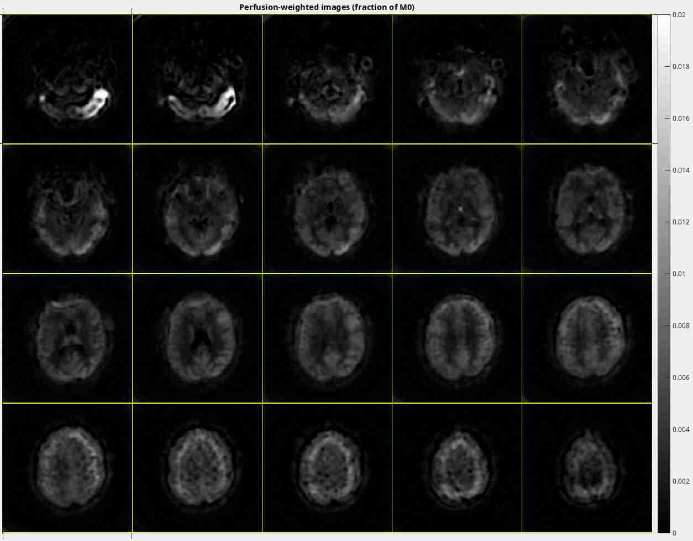

# 3D FLASH/SPGR stack-of-spirals velocity-selective ASL sequence in Pulseq

Here demonstrated on a GE 3T scanner.


## Create sequence files

```matlab
>> run sequence/main;
```

This creates the following Pulseq files,
and the corresponding `.pge` files for GE scanners:

1. **asl.seq**: Contains one label/control pair, using a Fourier-transform velocity-selective inversion (FTVSI) pulse.
2. **ir.seq**: Inversion-recovery sequence to test the adiabatic inversion pulse used for background suppression.
3. **vir.seq**: Inserts unbalanced gradients to mimick flow, 
    so that the FTVSI inversion profile can be validated in a stationary phantom.

The readout is identical for all scans, and consists of
an RF-spoiled gradient echo (FLASH/SPGR) 3D stack-of-spirals sequence.


## Execute the sequence on a GE scanner using the 'Pulseq on GE v2' (pge2) interpreter

See https://github.com/HarmonizedMRI/SequenceExamples-GE/tree/main/pge2/ for details.


## Reconstruct magnitude (coil-combined) images obtained with asl.seq

1. Put the ScanArchive file in the `./data/` folder and rename it to `data.h5`

2. Edit the file `recon/recon_asl.m`:
   1. Set path to GE's Orcehstra toolbox (download from the GE research user forum)
   2. Set number of runs (opnex). This value is set by the scanner operator.

3. Run nufft reconstruction script:
   ```matlab
   >> run recon/recon_asl;
   ```
4. Save the workspace variable `imsos` to a file named `ims.mat` and place it in the `./data/` folder.


## Perform ASL processing (display perfusion-weighted images)

```matlab
>> run process/main;   % load and display ims.mat
```


