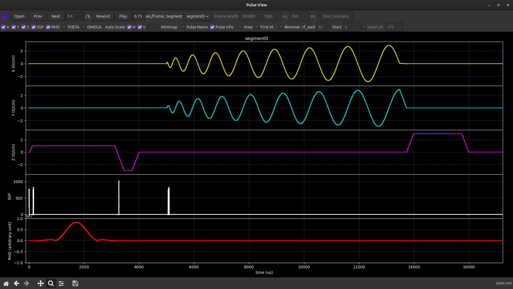

# 2D interleaved spiral sequence for Pulseq on GE 

Code for sequence generation and recon provided by Florian Wiesinger, GE

Tested on the following system(s):
* GE MR750
* SW version MR30.1\_R01
* Pulseq interpreter pge2 version: https://github.com/jfnielsen/TOPPEpsdSourceCode/releases/tag/v2.3.0

To download the required MATLAB packages,
create the pge sequence file, and reconstruct the data, see `main.m` in this folder.

Sequence plot using GE's Pulse View (https://github.com/GEHC-External/pulse-view):  

Example reconstruction result with PinvRecon\_IntSpiral:  

Important points to note when preparing a .seq file containing rotated gradients:
* Use the same TRID independently of rotation angle.
* The rotation is applied to the **entire segment** as a whole!
  In other words, the interpreter cannot rotate each block 
  within a segment independently.

See also https://github.com/HarmonizedMRI/SequenceExamples-GE/tree/main/pge2/
