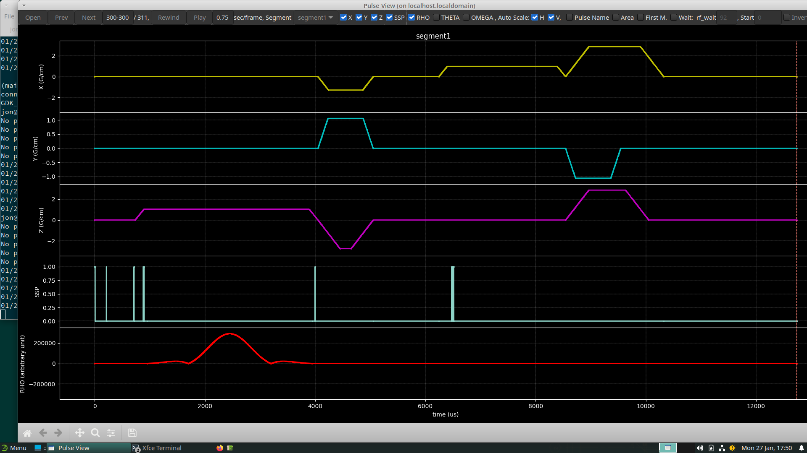
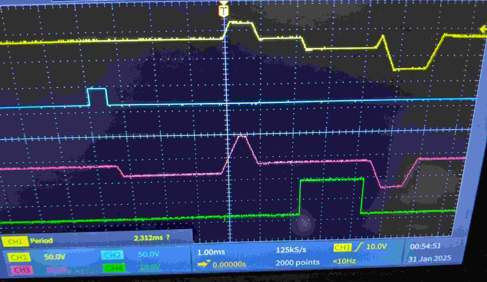

# 2D spoiled GRE sequence for tv6 (Pulseq on GE v1) with DABOUT output trigger/TTL pulse

This example is work in progress.

Currently testing on the following system:
* GE MR750 
* SW version MR30.1_R01
* Pulseq interpreter tv6 [v1.9.1](https://github.com/jfnielsen/TOPPEpsdSourceCode/releases/tag/v1.9.1)

Result: TTL trigger on DABOUT6/J6 (CV7 = 6) works, but other channels don't seem to.

See [main.m](main.m).

This example is similar to the example in ../2DGRE/, it just adds an external trigger 
prior to the rf event.

Note:
* The **start position** of the TTL pulse is determined by the trigger event delay.
  The start position will be stated in modules.txt for the relevant block.
* The **duration** of the trigger is determined by the control variable `trigdur` on the scanner console.
  It defaults to 500us.
* **Only one segment** can contain a TTL trigger out. If a trigger is specified in subsequent segments,
  the interpreter ignores it.
* If a trigger is added to a segment, it will require a **separate TRID**.

When simulating in WTools/PulseStudio, you can see the two trigger-related SSP pulses 
(trigon and trigoff)
at about 200us and 700us from the beginning of the TR, respectively:

When selecting channel 6 (CV7 = 6), the output on J6 is a 500us pulse as seen in the 2nd channel on this scope trace:

